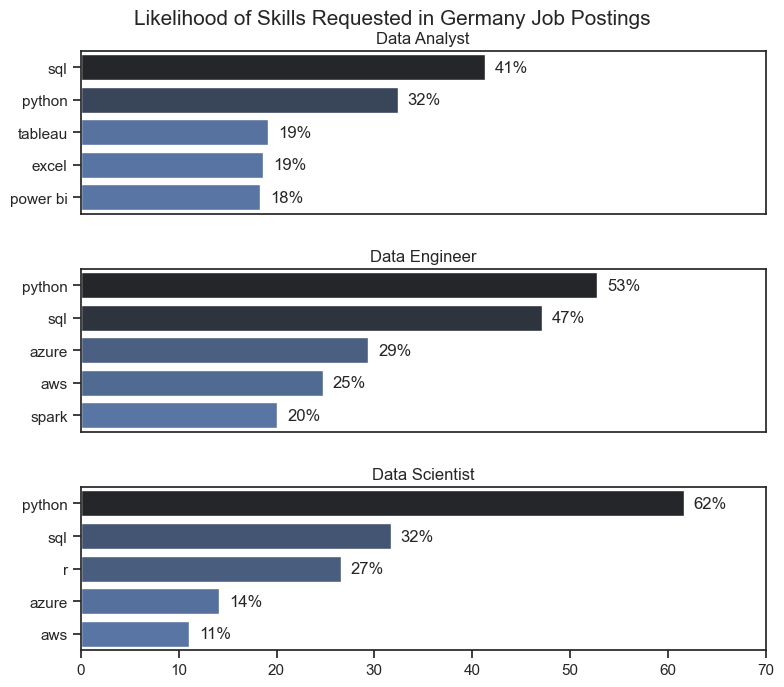
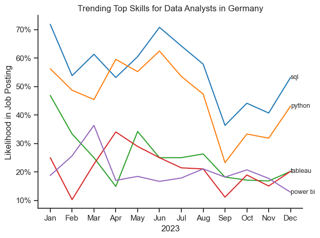
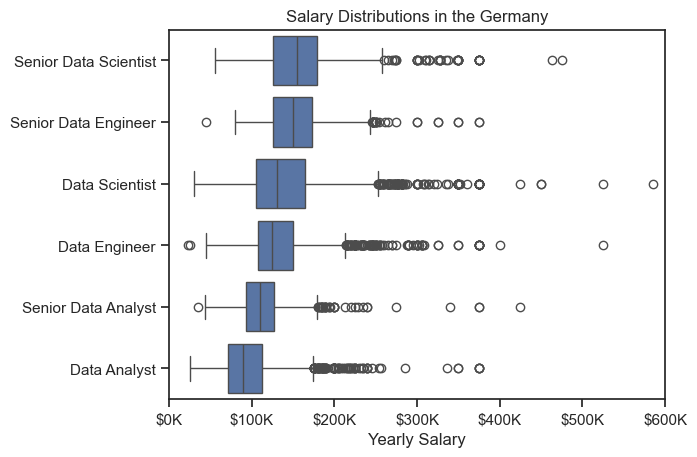
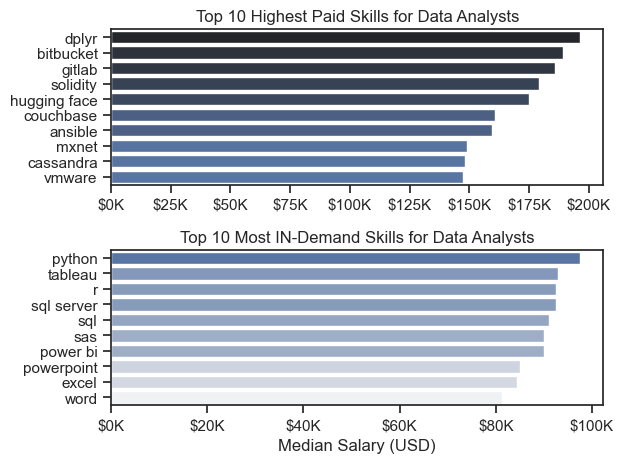
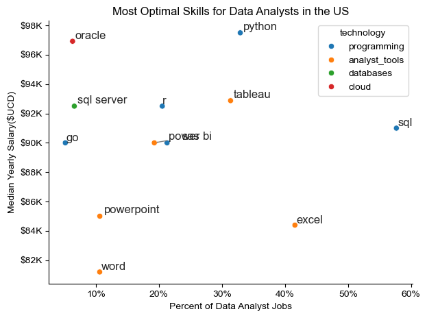

# The Analysis

## 1. What are the most demanded skills for the top 3 most popular data roles?

To find the most demanded skills for the top 3 most popular data roles. I filtered out those positions by which ones were the most popular, and got the top 5 skills for these top 3 roles. This query highlights the most popular job titles and their top skills, showing which skills I should pay attetion to depending on the role I'm targeting.

View my notebook with detailed steps here:
[2_Skill_Demand.ipynb](2_Skill_Demand.ipynb)

### Visualize Data

```python
for i, job_title in enumerate(job_titles):
    # Filter top 5 skills for each job
    df_plot = df_skills_perc[df_skills_perc['job_title_short'] == job_title].head(5)
    ax[i].set_title(job_title)
    for n, v in enumerate(df_plot['skill_percent']):
        ax[i].text(v + 1, n, f'{v:.0f}%', va='center')

    if i != len(job_titles)- 1:
        ax[i].set_xticks([])

    # Plot horizontal bar chart
    #df_plot.plot(kind='barh', x='job_skills', y='skill_percent', ax=ax[i], title=job_title, legend=False)
    sns.barplot(data=df_plot, x='skill_percent', y='job_skills', ax=ax[i], hue='skill_count', palette='dark:b_r')
```

### Results



### Insights

- Python is a versatile skill, highly demanded across all three roles, but most prominetly for Data Scientists (62%) and Data Engineers(53%).
- SQL is the most requested skill for Data Analysts and Data Scientists, with it in over half the job postings for both roles. For Data Engineers, Python is the most in_demand skills, appearing in (53%) of jon postings.

## 2. 📈 Trending Data Analyst Skills in Germany (2023)

### Visualize Data

```python
from matplotlib.ticker import PercentFormatter

# Set theme before plotting
sns.set_theme(style='ticks')

# Create line plot
ax = sns.lineplot(data=df_plot, dashes=False, palette='tab10')

# Clean up axis
sns.despine()
ax.yaxis.set_major_formatter(PercentFormatter())

# Labels
plt.title('Trending Top Skills for Data Analysts in Germany')
plt.ylabel('Likelihood in Job Posting')
plt.xlabel('2023')
```

### Results


This chart shows the top 5 most requested skills in Data Analyst job postings throughout 2023 in Germany, based on monthly frequency.

## Key Insights:

- SQL and Python consistently lead as the most in-demand skills.
- Tableau and Power BI appear less frequently but remain relevant for data visualization roles.
- Seasonality or hiring waves may influence fluctuations, particularly in spring and fall.

📊 Data is based on job postings scraped and analyzed from various platforms, filtered by title and country.

# The Analysis

## 3. How well do jobs and skills pay for Data Analysts?

### Salary Analysis for Data Nerds

#### Visualize Data

```python
sns.boxplot(data=df_US_top6, x='salary_year_avg', y='job_title_short', order=job_order)
sns.set_theme(style='ticks')

#this is all the same
plt.title('Salary Distributions in the Germany')
plt.xlabel('Yearly Salary')
plt.ylabel('')
plt.xlim(0,600000)
tick_x = plt.FuncFormatter(lambda y, pos: f'${int(y/1000)}K')
plt.gca().xaxis.set_major_formatter(tick_x)
plt.show()
```


_Box plot visualizing the salary distributions for the top 6 data job titles._

- Senior roles such as Senior Data Scientist and Senior Data Engineer consistently have higher median salaries.

- Entry-level positions like Data Analyst and Junior roles fall on the lower end of the salary range.
- There's noticeable salary overlap across roles, indicating that experience, company, and location significantly influence pay within the same title.

### ✅ Conclusion

The data shows a clear upward trend in salaries with increasing job seniority. Understanding these distributions helps job seekers and hiring teams align expectations around compensation in the U.S. data job market.

# The Analysis

## 4. How well do jobs and skills pay for Data

### Highest Paid & Most Demanded Skills for Data

```python
fig, ax = plt.subplots(2, 1)
sns.set_theme(style='ticks')

sns.barplot(data= df_DA_top_pay, x='median', y=df_DA_top_pay.index, hue='median', ax=ax[0], palette='dark:b_r')
ax[0].legend().remove()

#Top 10 Highest Paid Skills for Data Analysts
ax[0].set_title('Top 10 Highest Paid Skills for Data Analysts')
ax[0].set_ylabel('')
ax[0].set_xlabel('')
ax[0].xaxis.set_major_formatter(plt.FuncFormatter(lambda x, _: f'${int(x/1000)}K'))

sns.barplot(data= df_DA_skills, x='median', y=df_DA_skills.index, hue='median', ax=ax[1], palette='light:b')
ax[1].legend().remove()

#Top 10 Most IN-Demand Skills for Data Analysts
ax[1].set_title('Top 10 Most IN-Demand Skills for Data Analysts')
ax[1].set_ylabel('')
ax[1].set_xlabel('Median Salary (USD)')
ax[1].xaxis.set_major_formatter(plt.FuncFormatter(lambda x, _: f'${int(x/1000)}K'))

plt.tight_layout()
plt.show()

```

#### Results

In_demand skills for data analysts in the US:


_Two separate bar graphs visualizing the highest paid skills and most in-demand skills for data analysts in the US,_

# The Analysis

## 5. Wha is the most optimal skill to learn for Data Analysts?

### Visualize Data

```python
from matplotlib.ticker import PercentFormatter
from adjustText import adjust_text

#df_plot.plot(kind='scatter', x='skill_percent', y='median_salary')
sns.scatterplot(
    data=df_plot,
    x='skill_percent',
    y='median_salary',
    hue='technology'
)
sns.despine()
sns.set_theme(style='ticks')

texts =[]
for i, txt in enumerate(df_DA_skills_hight_demand.index):
    texts.append(plt.text(df_DA_skills_hight_demand['skill_percent'].iloc[i], df_DA_skills_hight_demand['median_salary'].iloc[i], txt))
```

#### Results


A scatter plot visualizing the most optimal skills (hight paying & high demand) for data analysts in the US,

#### Insights:

- The scatter plot shows that most of the `programming` skills (colored blue) tend to cluster at higher salary levels compared to other categories , indicating that programming expertise might offer greater salary benefits within the data analytics field.
- Analyst tools (colored orange), including Tableau and Power BI, are prevalent in job postings and pffer comptitve salaries , showing that visualization and data analysis software are crucial for current data roles. This category not only has good salaries but is also versatile across different types of data tasks.
